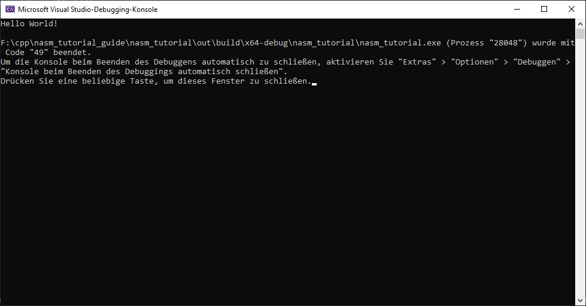

# x64 NASM mit Visual Studio 2022 Guide

## Vorrausetzungen

- [nasm](https://www.nasm.us/)
- [Visusl Studio 2022](https://visualstudio.microsoft.com/de/) inklusive CMake
- ein paar C Kennntnisse

## Einführung zu Registern und der Calling Convention
Anders als in gewöhlichen Programmiersprachen arbeitet man in Assembler nicht mit Variablen sondern mit Prozzesorregistern. Ein Register ist eine kleine Speichereinheit im Prozessor mit einer Größe von 8 Byte (auf einem x64 System), in denen beliebige 8 Byte große Werte gespeichert werden können. Da 8 Byte wahrscheinlich ziemlich wenig wären, gibt es zum Glück 16 Register im Prozessor, diese haben die folgenden Namen:
- RAX
- RCX
- RDX
- R8
- R9
- R10
- R11
- R12
- R13
- R14
- R15
- RBX
- RBP
- RDI
- RSI
- RSP

Es gibt noch einige weitere Register, die aber nicht direkt veränderlich sind oder nur für bestimmte Operationen gebraucht werden, dazu kommen wir aber zu gegebener Zeit. Außerdem möchte ich noch davor warnen die unteren 9 Register, also alles unter R11 in dieser Liste, einfach so zu überschrieben, sofern man nicht weiß was man da tut, dazu werden auch noch im Einzelnen später kommen.

Wenn man in Assembler eine Funktion aufruft müssen auch die Parameter dieser Funktion mithilfe von Registern übergeben werden. Dazu werden die Paramter der Funktion in Registern gespeichert bevor die Funktion aufgerufen wird. Die aufgerufene Funktion findet ihre Parameter dann in den entsprechenden Registern. Um zu regeln welche Parameter in welches Register gespeichert werden, gibt es die Calling Convention. Windows und Linux haben jeweils eine eigene Calling Convention. Für den Anfang reicht es aber erstmal zu wissen, wie auf Windows Parameter übergeben werden. Der erste Parameter einer Funktion wird im Register RCX gespeichert, der zweite im Register RDX, der dritte in R8 und der vierte in R9 oder übersichtlicher so:

<table>
  <tr>
    <td>Parameter</td>
    <td>1</td>
    <td>2</td>
    <td>3</td>
    <td>4</td>
  </tr>
  <tr>
    <td>Register</td>
    <td>RCX</td>
    <td>RDX</td>
    <td>R8</td>
    <td>R9</td>
  </tr>
</table>

Auch der Rückgabewert einer Funktion muss in ein Register gespeichert werden, in das Register RAX um genau zu sein. Bevor eine Funktion endet und mit return zurückkehrt, wird der Rückgabewert in RAX abgelegt.

Wenn man also eine Funktion hat, die in C so aussähe:
```C
int func1(int a, int b, int c, int d);
```
hätte man den Parameter a in RCX, b in RDX, c in R8 und d in R9.

Weiteres zur Windows Calling Convention kann man [hier](https://learn.microsoft.com/en-us/cpp/build/x64-calling-convention?view=msvc-170) finden, aber für den Anfang reicht es den hier erkläten Teil zu kennen.

## Erste Schritte

### Ein neues Projekt anlegen
Zuerst legen wir ein neues Projekt in Visual Studio an und wählen dabei CMake als Vorlage aus


Visual Studio legt dabei auch direkt einen Unterordner mit einem cpp Hello World Programm an. Das brauchen wir aber nicht und entfernern es daher direkt zusammen mit der Header Datei. 
Stattdessen legen wir dort eine C Datei mit dem Namen ```main.c``` an, die wir benutzen werden um unsern Assembler Code auszuführen. In diesem Ordner sollten auch allen anderen Dateien liegen, die wir noch anlegen. Aber erstmal sieht das nun so aus:


### Das erste Assembler Programm
Anders als bei den meisten Programmiertutorials fangen wir nicht mit einem Hello World an, sondern wir implementieren die Grundrechenarten in Assembler. Das Arbeiten mit Zahlen ist in Assembler nämlich deutlicher leichter als das Arbeiten mit Strings oder gar Konsolenausgaben.

Um diese Funktionen auch in C später benutzen zu können, legen wir eine Header Datei mit dem Name ```calc.h``` an und deklarieren darin folgende Funktionen:
```C
int addition(int a, int b);
int subtraktion(int a, int b);
int multiplikation(int a, int b);
int division(int a, int b);
```

Dann legen wir die eigentliche Assembler Datei an und nennen sie ```calc.asm```. Die erste Zeile sollte lauten:
```asm
SECTION .text
```
Eine Assembler Code Datei besteht aus mehreren Sektionen, die vermutlich wichtigste ist ```.text```, darin befindet sich der Code nacher ausgeführt wird. Später werden wir noch andere Sektionen kennenlernen, die andere Teile des Programms beinhalten, die z.B. reservierte Bereiche im Arbeitsspeicher anlegen. Fürs erste werden wir aber nur ```.text``` brauchen.

Fangen wir an mit der Funktion für die Addition: Um eine Funktion zu schreiben, die auch aus unserem C Programm aufgerufen werden kann, müssen wir kenntlich machen wo im Code unsere Funktion beginnt. Das machen wir mit einem Label. Ein Label besteht aus einem Bezeichner gefolgt von einem Doppelpunkt. Wir können beliebig viele Labels erstellen, aber wir brauchen ein Label mit dem Namen der Funktion als Bezeichner, damit die Funktion nachher beim Kompilieren vom Linker gefunden wird. Wir legen also so ein entsprechendes Label für unsere Funktion an:
```asm
SECTION .text

addition:

```
Damit ist jetzt gekennzeichnet ab wo der Code für die Funktion ```addition``` beginnt. Aber Label sind nicht für externe Dateien sichtbar, d.h. der Linker würde unsere Funktion immer noch nicht finden. Mithilfe des Keywords ```GLOBAL``` können wir ein Label aber auch nach außen hin sichtbar machen. Dazu schreiben wir oben an den Anfang unserer Datei das Keyword ```GLOBAL``` und dann unser Label:
```asm
GLOBAL addition
SECTION .text

addition:
```

Nun fehlt aber noch der eigentliche Code. Der Assmbler Befehl für das addieren zweier Ganzzahlen ist ```ADD``` und hat zwei Operanden ```dest``` und ``src``, getrennt durch ein Komma. Der ```ADD``` Befehl addiert die Werte von ```src``` und ```dest``` und speichert das Ergebnis in ```dest```. Wenn wir also ```ADD RAX, RCX``` als Befehl schreiben, werden die Werte in RAX und RCX addiert und das Ergebnis in RAX gespeichert. Der Befehl überschreibt dabei den ursprünglichen Wert in RAX. Um ```ADD``` für unsere Funktion zu benuzten, müssen wir nun nur noch wissen welche Register wir als Operanden hinzufügen müssen. Wenn wir uns also nochmal an die Calling Convention erinnern, sehen wir, dass die beiden Parameter für unsere Funktion in RCX und RDX finden werden, also fügen wir diese beiden als Operanden hinzu:
```asm
GLOBAL addition
SECTION .text

addition:
    ADD RCX, RDX

```
(Die Einrückung des Befehls ist optisch und nicht zwingend nötig.)

Wenn dieser Befehl nun ausgeführt wird, werden die beiden Parameter unserer Funktion, die in den Registern RCX und RDX zu finden sind, addiert und das Ergebnis in RCX gespeichert.

Unsere Funktion ist damit aber noch nicht fertig. Wir müssen das Ergebnis unserer Rechnung auch noch als Rückgabewert zurückgeben. Laut Calling Convention wird der Rückgabewert in RAX gespeichert, also müssen wir unser Ergebnis von RCX nach RAX kopieren. Dazu gibt es den ```MOV``` Befehl, der ebenfalls die Operanden ```dest``` und ```src``` hat. Wie die Namen schon vermuten lassen, wird hier der Wert von ```src``` nach ```dest``` kopiert. Ganz zum Ende unserer Funktion fügen wir dann noch den Befehl ```RET``` ein. Der funktioniert ähnlich wie die ```return``` Anweisung in vielen Sprachen und beendet die Ausführung der Funktion. Anders als in vielen Sprachen ist diese Anweisung hier aber explizit notwendig und das Program würde nicht funktionieren wenn man das ```RET``` einfach weglässt. Am Ende sieht unsere Funktion also so aus:
```asm
GLOBAL addition
SECTION .text

addition:
    ADD RCX, RDX
    MOV RAX, RCX
    RET

```
Für etwas bessere Verstänlichkeit können wir noch Kommentare zu unserem Code hinzufügen. In nasm beginnen Kommentare mit einem Semicolon:
```asm
GLOBAL addition
SECTION .text

addition:           ;addition Funktion mit den Parametern in RCX und RDX
    ADD RCX, RDX    ;Addiert RCX und RDX und speichert das Ergebnis
    MOV RAX, RCX    ;Kopiert das Ergebnis von RCX nach RAX
    RET             ;Ende der Funktion

```
### Der C Teil unseres Programms
Bevor wir mit den übrigen Funktionen weitermachen, werden wir erstmal unseren C Teil hinzufügen und unser Programm kompilieren und austesten. Da das hier kein C Tutorial ist, gebe ich den C Code hier einfach mal vor.
```C
#include <stdio.h>
#include <stdlib.h>
#include "calc.h"

int main(int argc, char* argv[]) {
	int a, b;
	if (argc >= 3) {
		a = atoi(argv[1]);
		b = atoi(argv[2]);
	}
	else
	{
		a = 12;
		b = 3;
	}
	int add = addition(a, b);
	printf("%i + %i = %i\n", a, b, add);
	
}
```
Der Code ruft unsere ```addition``` Funktion auf mit Parametern aus der Kommandozeile oder sonst mit den Werten 12 und 3 als Beispiel.

### CMake anpassen und kompilieren
Visual Studio hat für uns bei der Erstellung des Projekts zwei CMakeLists.txt angelegt. Wir brauchen aber nur die CMakeLists.txt, die in dem Ordner mit unserem Code liegt. 
Um unser Programm kompilieren zu können müssen wir CMake nur mitteilen, dass wir nasm verwenden und welche Dateien wir zur Exe hinzugefügt haben wollen.  Den von Visual Studio erstellten Code überschreiben wir einfach mit:
```CMake
cmake_minimum_required (VERSION 3.8)

enable_language(ASM_NASM)

add_executable (nasm_tutorial main.c calc.asm)
```
Dies teilt CMake mit, dass wir nasm benuzten und dass die finale Exe ```nasm_tutorial.exe``` aus den Quellcodedateien ```main.c``` und ```calc.asm``` erzeugt werden soll.
Nun können wir unser Programm kompilieren indem wir in Visual Studio auf Erstellen -> Alle erstellen drücken oder Strg+Shift+B drücken und können es dann mit F5 ausführen oder die Schaltfläche zum Debuggen drücken. Eventuel muss die erstellte exe noch als Startelement ausgewählt werden. 


Und nun können wir das Ergebnis der Rechnung mithilfe unseres ersten Assembler Programms bewundern:


### Die übrigen Funktionen
Nun fehlen noch die Funktionen für die anderen drei Rechenarten. Mit dem was wir beim Schreiben der ersten Funktion gelernt haben, sollte das nun kein Problem mehr darstellen. Nur brauchen wir neue Befehle um zu subtrahieren, multiplizieren und dividieren. An dieser Stelle möchte ich daher mal auf das Handbuch [hier](https://www.amd.com/system/files/TechDocs/24594.pdf) hinweisen. Darin findet sich unter anderm alles was man zu den Befehlen wissen muss (welche Operanden sie verwenden, was der Befehl macht, und was noch durch den Befehl beeinflusst wird). Das Inhaltsverzeichnis gibt eine gute Übersicht über alle Befehle (zu finden in Kapitel 3) und hilft die Erklärungen zu einzelnen Befehlen zu finden. Die Befehle für Addition und Substraktion sind ```ADD``` und ```SUB```, die Befehle für Multiplikation und Division sind ```MUL``` und ```DIV``` bzw. ```IMUL``` und ```IDIV``` für vorzeichenbehaftete Multiplikation und Division. Mit den Namen der Befehle, dem Handbuch, und bisher gelernten sollte es dann kann kein Problem sein selbst auf den Code für die übrigen Funktionen zu kommen.
Hier der C Code mit dem dann auch die übrigen Funktionen getest werden können:

```C
#include <stdio.h>
#include <stdlib.h>
#include "calc.h"

int main(int argc, char* argv[]) {
	int a, b;
	if (argc >= 3) {
		a = atoi(argv[1]);
		b = atoi(argv[2]);
	}
	else
	{
		a = 12;
		b = 3;
	}
	int add = addition(a, b);
	int sub = subtraktion(a, b);
	int mul = multiplikation(a, b);
	int div = division(a, b);
	printf("%i + %i = %i\n", a, b, add);
	printf("%i - %i = %i\n", a, b, sub);
	printf("%i * %i = %i\n", a, b, mul);
	printf("%i / %i = %i\n", a, b, div);
	
}
```
Am Ende dieses Guides findet sich auch eine Lösung mit dem Assembler Code zum Nachprüfen oder falls Hilfe benötigt wird. Wer aber noch nicht sofort aufgeben möchte, findet eventuell auch Hilfe im nächsten Kapitel.

## Debugging in Visual Studio
Wenn ein Programm mal nicht das macht was es soll, hilft es ungemein das Programm mit einem Debugger Schritt für Schritt durchgehen zu können. Zum Glück kommt Visual Studio direkt mit einem Debugger, der sich auch für unsere Assembler Programme nutzen lässt, wir müssen nur ein paar Zeilen in CMakeLists.txt hinzufügen und eventuell die Ansicht in Visual Studio anpassen um auch wirklich relevante Informationen zu sehen.

### nasm mit Debug Symbolen kompilieren
Damit der Debugger unseren Code und das ausgeführte Programm einander richtig zuordnen kann, muss nasm unseren Code mit Debug Symbolen kompilieren. Dazu fügen wir folgende Zeile in unser CMakeLists.txt ein:
```CMake
set(CMAKE_ASM_NASM_FLAGS_DEBUG "-g -F cv8")
```
Dies teilt CMake mit, dass wir beim Erstellen eines Debug-Builds die angegebenen Flags gesetzt haben wollen, was dann wiederrum nasm veranlasst die nötigen Debug Symbole in der Ausgabe mit einzuschließen. Das vollständige CMakeLists.txt sieht nun so aus:
```CMake
cmake_minimum_required (VERSION 3.8)

enable_language(ASM_NASM)
set(CMAKE_ASM_NASM_FLAGS_DEBUG "-g -F cv8")

add_executable (nasm_tutorial main.c calc.asm)
```
### Den Debugger nutzen
Der Visual Studio Debugger lässt sich nun wie gewohnt nutzen. Wir können breakpoints (oder auf deutsch "Haltepunkte") in unserem Code setzen und dann das Programm Schritt für Schritt durchgehen. Wer das nun direkt ausprobiert, dem fällt allerdings auf, dass die Überwachung der Variablen in diesem Fall gar nichts bringt da es gar keine Variablen zum Anzeigen gibt. Stattdesen können wir uns in Visual Studio aber auch den Inhalt der Register anzeigen lasssen. Dafür müssen wir erst im Menü Debuggen -> Optionen sicherstellen, dass "Debugging auf Adressebene aktivieren" ausgewählt ist:


Dann können wir, wenn wir ein Programm debuggen, im Menü Debuggen -> Fenster auswählen, dass wir die Register angezeigt bekommen möchten. Die Option erscheint dort aber nur, wenn der Debugger gerade auch läuft.


Wir erhalten dann ein neues Fenster, das wir wie alles Fenster in Visual Studio verschieben können, in dem wir den Inhalt der verschiedenen Register sehen können. Die Werte werden in hexadezimal dargestellt. Rote Werte sind Werte, die sich seit dem letzten Haltepunkt oder Schritt verändert haben.


## Den Mittelsmann loswerden
Bisher haben wir ein C Programm als Startpunkt verwendet, das dann unsere Assembler Funktionen aufruft und das Ergebnis wieder ausgibt. Heutzutage wird wahrscheinlich niemand versuchen ein Programm nur in Assembler zu schreiben, aber es ist möglich und wir werden uns nun ansehen was es dabei zu beachten gibt.

### Ein neuer Startpunkt
Als erstes werden wir eine Datei anlegen für unsere neue main Funktion. Wir legen die Datei als ```main.asm``` im selben Ordner ab wie schon unsere anderen Quelldateien. Wie schon zuvor bei den Rechenaufgaben legen wir mittels eines Labels eine neue Funktion namens ```main``` an und machen sie durch das ```GLOBAL``` keyword nach außen sichtbar. Die in der main Funktion fügen wir später noch mehr Code ein um unsere anderen Funktionen aufzurufen, aber fürs erste fügen wir nur ein ```RET``` um das Programm direkt wieder zu beenden.

```asm
GLOBAL main
SECTION .text

main:
	RET
```

Bevor wir unseres neues Programm aber kompilieren können, müssen wir aber wieder mal ein paar Anpassungen an die CMakeLists.txt machen. Zum einen müssen wir CMake mitteilen, dass wir den Linker benutzen möchten, der auch für C benutzt wird. Aus irgendeinem Grund versucht CMake sonst, wenn keine C Dateien dabei sind, unseren Code mit nasm zu linken. nasm kann allerdings nicht linken, daher müssen CMake konfigurieren den Linker von Visual Studio zu verwenden. 
Dann müssen wir auch noch einstellen, dass wir für unsere Exe nicht mehr ```main.c```, sondern ```main.asm``` verwenden möchten.

Zuletzt müssen wir noch eine Option für den Linker setzen, um ihm mitzuteilen, dass der Einstiegspunkt in unser Programm die Funktion ```main``` ist. Das mag manch einen verwundern, weil man ja denken könnte, die Funktion ```main``` sei doch standardmäßig der Einstiegspunkt für ein C Programm, warum sollte der Linker nicht auch unsere ```main``` Funktion als Einstiegspunkt verwenden? Auf Linux würden wir tatsächlich auch keine Probleme haben unser Program so zu linken, allerdings ist hier ```main``` tatsächlich nicht der standardmäßige Einstiegspunkt, sondern eine Funktion names ```mainCRTStartup```, nachzulesen in der [Online Dokumentation des Linkers](https://learn.microsoft.com/en-us/cpp/build/reference/entry-entry-point-symbol?view=msvc-170) und mehr zu den Funktionen, die der Linker als Standardeinstiegspunkt verwendet, [hier](https://stackoverflow.com/questions/60571577/what-is-invoke-main-and-maincrtstartup).

Mit den nötigen Anpassungen sieht unser CMakeLists.txt dann so aus:
```CMake
cmake_minimum_required (VERSION 3.8)

enable_language(ASM_NASM)

set(CMAKE_ASM_NASM_FLAGS_DEBUG "-g -F cv8")
set(CMAKE_ASM_NASM_LINK_EXECUTABLE "<CMAKE_LINKER> <CMAKE_ASM_NASM_LINK_FLAGS> <LINK_FLAGS> <OBJECTS>  /OUT:<TARGET> <LINK_LIBRARIES>")
set(CMAKE_ASM_NASM_LINK_FLAGS "/ENTRY:main")

add_executable (nasm_tutorial main.asm calc.asm)

```
Wir können unser Programm nun kompiliern und ausführen. Natürlich macht unser Programm noch nichts und auch der exit code ist irgendein zufälliger Wert der am Ende der Ausführung gerade im Register RAX war.

### Funktionen aufrufen
Auch in Assembler ist es möglich andere Funktionen aufzurufen. Zum einen gibt es den Befehl ```JMP```. Mit diesem Befehl springt man in der Ausführung des Codes an eine andere Zeile/Adresse. Man könnte beispielsweise ```JMP addition``` schreiben und das Programm würde dann in seiner Ausführung zu der Funktion ```addition``` springen und diese ausführen. Allerdings funktioniert der ```JMP``` Befehl nur in eine Richtung, nach der Ausführung der Funktion kann nicht zurück zu der aufrufenden Funktion gesprungen werden, es sei denn man hätte dort ein weiteres ```JMP``` stehen das zurück springt. Das Problem dabei ist aber das man ja nicht wissen kann von wo man aufgerufen wurde und es dementsprechend schwierig ist zu wissen wohin man zurück springen sollte.

Abhife schafft hier der Befehl ```CALL```. Wie auch ```JMP``` springt ```CALL``` an die angegebene Adresse einer Funktion (oder auch jeden anderen Labels). Im Unterschied zu ```JMP``` merkt sich ```CALL``` jedoch wo sich das Programm befindet bevor man in die Funktion springt. Mit einem weitern Befehl kann man dann zurück an die zuvor von ```CALL``` gemerkte Adresse zurückspringen, also zurück in die aufrufende Funktion. Dieser Befehl ist ```RET```, den wir bereits vorher benutzt haben. Deswegen hatte ich zu Beginn unseres ersten Programms auch erwähnt, dass diese ```RET``` am Ende einer Funktion so wichtig sei. Ohne das ```RET``` würde die Ausführung nicht zurück an die aufrufende Funktion springen und einfach den Code ausführen der nach der Funktion kommt. Das kann eine andere Funktion sein, es kann aber uninitialisierter Speicher sein, woduch unvorhergesehene Befehle ausgeführt werden könnten, aber wahrscheinlich wird das Programm einfach abstürzen.

Für unser Programm wollen wir ```CALL``` verwenden um eine der Funktionen, die wir zuvor geschrieben haben, aufzurufen. Die Funktion, die wir aufrufen wollen befindet sich aber in einer anderen Datei, daher müsssen wir nasm mitteilen, dass sich das Label dieser Funktion in einer externen Datei und nicht in dieser Datei befindet. Das machen wir mit dem Keyword```EXTERN```, das ähnlich wie ```GLOBAL``` verwendet wird, nur dass ```EXTERN``` ein Label von außerhalb in unser Datei bekannt macht und ```GLOBAL``` ein Label aus unserer Datei nach außerhalb bekannt macht.

Da wir noch keine Möglichkeit geschaffen haben irgendwie über die Konsole mit unserem Programm zu kommunizieren schreiben, rufen wir unsere Funktion mit festen Parametern auf. Als erstes legen wir unsere Parameter dafür in den entsprechenden Registern ab und rufen dann mit ```CALL``` unsere Funktion auf. Wir erhalten das Ergebnis in RAX und werden das auch erstmal da lassen, da der exit code, also der Rückgabewert der main Funktion, auch gerade unser einziger Weg ist, einen Wert aus dem Programm nach außen zu kommunizieren.
Unser ```main.asm``` sieht nun so aus:
```asm
GLOBAL main
EXTERN addition
SECTION .text

main:
	MOV RCX, 42		; 42 als erster Parameter
	MOV RDX, 7		; 7 als zweiter Parameter
	CALL addition	; unsere Additionsfunktion aufrufen
	RET				; Als exit code unseres Programms sollte
					; uns nun 49 angezeigt werden
```
Anstelle von ```addition``` können wir natürlich jede andere unserer Funktionen hier verwenden, sie muss nur über ```EXTERN``` auch hier bekannt gemacht werden.

## Hello World

Nachdem wir nun wissen wie wir Funktionen aufrufen und unseren eigenen Einstiegspunkt festlegen können, haben wir fast alles was wir brauchen um ein Hello World Programm zu schrieben.

### Ausgabe auf der Konsole
Um Sachen auf der Konsole auszugeben, brauchen wir die Windows-API. Assembler hat natürlich nicht wie höhere Programmiersprachen eine fertige `print` Funktion, sondern wir verwenden eine Funktion von Windows um direkt etwas auf die Konsole zu schreiben. Die Funktion dafür heißt `WriteConsoleA`. Die Dokumentation dafür finden wir [hier](https://learn.microsoft.com/en-us/windows/console/writeconsole?redirectedfrom=MSDN) (der Link führt zu Dokumentation für `WriteConsole`, allerdings ist `WriteConsoleA` nur ein anderer Name für diese Funktion für ANSI Strings). Wie wir sehen hat diese Funktion 5 Parameter: einen Handle für die Konsole, einen Pointer auf den Buffer mit dem String, den wir ausgeben wollen, die Länge des String, einen Pointer auf eine Variable, die tatsächlich geschriebenen Bytes zählt und einen unbenutzten Parameter. 

Um an den ersten Parameter, den Handle, zu kommen brauchen wir eine weiter Funktion `GetStdHandle`. Die Dokumentation findet sich [hier](https://learn.microsoft.com/en-us/windows/console/getstdhandle?redirectedfrom=MSDN). Diese Funktion braucht nur einen Parameter, der angibt für welche Ausgabe man den Handle haben möchte. Im unserem Fall wollen wir die Standardausgabe, also `STD_OUTPUT_HANDLE`, haben also muss der Parameter -11 sein. Die Rückgabe ist der Handle, den wir brauchen.

Für den nächsten Parameter brauchen wir jedoch einen String im Arbeitsspeicher und einen zugehörigen Pointer. Bis jetzt haben wir nur mit Registern gearbeitet, aber nun lernen wir eine neue Sektion kennen um Daten im Speicher abzulegen.

### Die `.data` Sektion
Diese neue Sektion ist die `.data` Sektion. Darin befindet sich vorab initialisierter Speicher, der auch nicht mehr verändert werden kann, also quasi globale Konstanten. Wir werden sie brauchen um darin den Text zu speichern, den wir ausgeben wollen, also "Hello World!".

Dazu legen wir entweder vor oder nach der `.text` Sektion die `.data` Sektion an und schreiben unsere Daten wie folgt dort hinein:
```asm
SECTION .data

message:	db  "Hello World!", 13, 10
msglen:		equ $-message
```

Der erste Teil `message:` ist ein Label, das wir brauchen um nacher auf diesen Speicher zuzugreifen, denn genau genommen dient ein Label dazu einen bestimmten Bereich im Arbeitsspeicher zu makieren und enthält eine Speicheradresse. Bisher haben wir Label nur benutzt um den Beginn einer Funktion zu makieren, aber auch alle Funktionen liegen bei Ausführung im Speicher. In diesem Fall makieren wir aber keinen Code im Speicher sondern Daten, was in technischer Hinsicht zwar keinen Unterschied macht, aber wir werden das Label dann natürlich anders verwenden.

`db` ist eine nasm Pseudo Instruktion. Es ist eine Instruktion, die keinem tatsächlichem Maschinencode entspricht, aber dazu dient nasm mitzuteilen, dass wir im folgeneden Daten Bytes (daher auch `db`) deklarieren. Alles was wir nun in die Ziele hinter `db` wird an dieser Stelle nacheinander im Speicher abgelegt. Zuerst haben wir den String "Hello World!", der von nasm in die entsprechenden Bytes umgewandelt wird und dahinter die Bytes 13 und 10. Die Bytes 13 und 10 sind die Bytes für Carriage Return und Linefeed also die Bytes für einen Zeilenumbruch auf Windows.

Die Zeile darunter beginnt ebenfalls mit einem Label gefolgt von einer weiteren Pseudo Instruktion `equ`. Diese Instruktion weist dem Label in dieser Zeile den Wert nach der Instruktion zu, also in diesem Fall `$-message`, anstelle einer Speicheradresse. `$` steht hier für die Adresse an dieser Stelle im Speicher, an der sich diese Instruktion befindet und `message` ist das Label, das wir in der Zeile darüber definiert haben. Da nasm alles was wir in die `.data` Sektion geschrieben haben nacheinander im Speicher ablegt, können wir so die Länge unseres Strings errechnen ohne selbst nachzählen zu müssen, indem wir beide Adressen subtrahieren. Die Länge des Strings steht somit im Label `msglen` und wir haben damit auch gleich den dritten Parameter für `WriteConsoleA`. Der vierte Parameter ist optional und wir werden daher einfach nur Null, statt eines Pointers übergeben und auch für den letzten ungenutzten Parameter übergeben wir nur Null.

### Der finale Code

Wir haben nun alles was wir brauchen um "Hello World!" auf der Konsole auszugeben. Den Code fügen wir in der `main` über dem Code aus dem vorigen Abschnitt ein. Der erste Funktionsaufruf sollte noch sehr leicht sein:
```asm
SECTION .text

main:
	MOV RCX, -11			; -11 als Parameter um STD_OUTPUT_HANDLE zu bekommen
	CALL GetStdHandle
```
Zusätzlich müssen wir auch noch die Funktionen `GetStdHandle` und `WriteConsoleA` mithilfe von `GLOBAL` bekannt machen.
```asm 
EXTERN GetStdHandle
EXTERN WriteConsoleA
```
Nun müssen die Parameter für den nächsten Aufruf in die entsprechenden Register geschrieben werden. Den fünften Parameter müssen wir laut Calling Convention auf dem Stack ablegen, den werden wir aber erst später behandeln, daher werde ich die Zeile hier noch nicht erklären. 
```asm
main:
	MOV RCX, -11			; -11 als Parameter um STD_OUTPUT_HANDLE zu bekommen
	CALL GetStdHandle
	MOV RCX, RAX			; Der Handle als erster Parameter für den nächsten Aufruf
	MOV RDX, message		; Pointer auf den String
	MOV R8, msglen			; Länge des Strings
	MOV R9, 0				; Null als vierter Paramter
	MOV dword [RSP+20h],0	; Fünfter Paramter auf den Stack, auch Null
	CALL WriteConsoleA		
```
Dieser Code funktioniert aber so noch nicht. Standardmäßig verwendet nasm absolute Adressen für Label. Da wir in x64 arbeiten, können wir die hier aber nicht benutzen. Daher fügen wir oben im Code noch `DEFAULT REL` ein, um nasm anzuweisen relative Adressen zu verwenden.
Der fertige Code, einschließlich des Code aus der vorigen AUfgabe für unser Hello World Programm sieht dann so aus:
```asm
GLOBAL main
EXTERN addition
EXTERN GetStdHandle
EXTERN WriteConsoleA

DEFAULT REL

SECTION .data

message:	db  "Hello World!", 13, 10
msglen:		equ $-message

SECTION .text

main:
	MOV RCX, -11			; -11 als Parameter um STD_OUTPUT_HANDLE zu bekommen
	CALL GetStdHandle
	MOV RCX, RAX			; Der Handle als erster Parameter für den nächsten Aufruf
	MOV RDX, message		; Pointer auf den String
	MOV R8, msglen			; Länge des Strings
	MOV R9, 0				; Null als vierter Paramter
	MOV dword [RSP+20h],0	; Fünfter Paramter auf den Stack, auch Null
	CALL WriteConsoleA		

	MOV RCX, 42				; 42 als erster Parameter
	MOV RDX, 7				; 7 als zweiter Parameter
	CALL addition			; unsere Additionsfunktion aufrufen
	RET						; Als exit code unseres Programms sollte
							; uns nun 49 angezeigt werden
```
 Bevor wir das und kompilieren und ausführen können, fehlt aber noch eine Sache. Wir müssen den Linker anweisen, die unser Programm mit der `kernel32.dll` zu verlinken, denn darin befinden sich die beiden Windows Funktionen die wir verwendet haben. Anderfalls würde der Linker die Funktionen nicht finden und das Linken würde fehlschlagen. Wir fügen dem CMakeLists.txt dazu eine weitere Zeile hinzu:
 ```cmake
 cmake_minimum_required (VERSION 3.8)

enable_language(ASM_NASM)

set(CMAKE_ASM_NASM_FLAGS_DEBUG "-g -F cv8")

set(CMAKE_ASM_NASM_LINK_EXECUTABLE "<CMAKE_LINKER> <CMAKE_ASM_NASM_LINK_FLAGS> <LINK_FLAGS> <OBJECTS>  /OUT:<TARGET> <LINK_LIBRARIES>")
set(CMAKE_ASM_NASM_LINK_FLAGS "/ENTRY:main")
link_libraries("kernel32.dll")

add_executable (nasm_tutorial main.asm calc.asm)
 ```
Nun können wir unser Programm ausführen und sehen endlich ein Hello World.




## Lösungen
### Die vier Grundrechenarten
```asm
GLOBAL addition
GLOBAL subtraktion
GLOBAL multiplikation
GLOBAL division
SECTION .text

addition:           ;addition Funktion mit den Parametern in RCX und RDX
    ADD RCX, RDX    ;Addiert RCX und RDX und speichert das Ergebnis in RCX
    MOV RAX, RCX    ;Kopiert das Ergebnis von RCX nach RAX
    RET         

subtraktion:
    SUB RCX, RDX    ;Subtrahiert RDX von RCX und speichert das Ergebnis in RCX
    MOV RAX, RDX    ;wie zuvor Ergebnis kopieren für die Rückgabe
    RET

; IMUL und IDIV sind eigentlich für vorzeichenbehaftete Multiplikation und Division,
; aber funktionieren quasi wie die ADD und SUB Befehle, daher hier MUL und DIV

multiplikation:
    MOV RAX,RCX     ;Der erste Faktor wird nach RAX verschoben
    MUL RDX         ;Der zweite Faktor ist der Operand von RDX
                    ;MUL multipliziert RAX mit dem Operanden, also RDX
    RET             ;Das Ergbenis befindet sich bereits in RAX 
                    ;also können wir direkt RET nutzen
    
division:
    MOV RAX,RCX     ;Der Dividend befindet sich in RAX
                    ;Allerdings ist der DIV Befehl für sehr große Zahlen ausgelegt, 
                    ;und RAX ist nicht der ganze Divdend sondern RDX und RAX zusammen
                    ;Für diese Operation werden RDX und RAX aneinandergehängt zu einer 
                    ;16 Byte (128bit) Zahl statt zweier 8 Byte Zahlen
    MOV R8, RDX     ;Daher können wir RDX auch nicht als Divisor verwenden
                    ;und kopieren den Divisor nach R8
    MOV RDX, 0      ;Da RDX und RAX zusammengefügt werden, muss RDX = 0 sein, damit 
                    ;wir nicht einen deutlich größeren Dividenden haben
    DIV R8          ;Dividieren durch den Divisor in R8
    RET             ;Der Quotient ist in RAX also verwenden wir direkt RET
                    ;DIV speichert den Rest der Division in RDX, 
                    ;womit sich auch Modulo hätte implementieren lassen

```